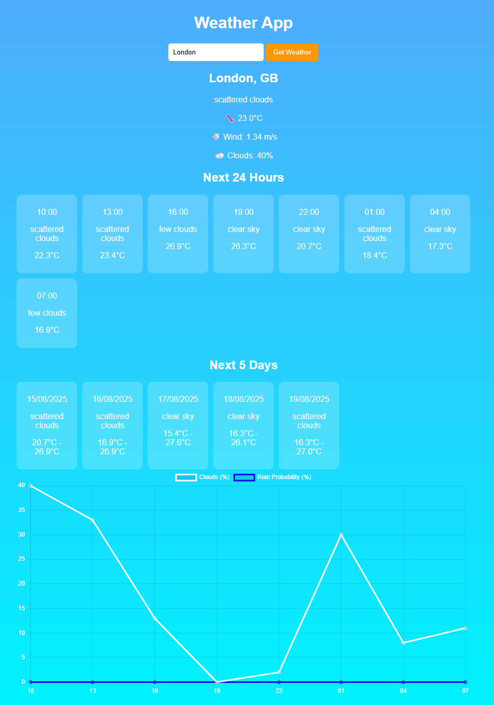

# 🌦 Weather Forecast App

A beautiful, modern weather application with dynamic backgrounds and smooth animations. Built with vanilla JavaScript and powered by free APIs from OpenWeather and Unsplash.



---

## ✨ Features

### 🎨 Modern UI/UX
- **Glassmorphism Design**: Beautiful frosted glass effect cards with backdrop blur
- **Dynamic Weather Backgrounds**: CSS-drawn weather illustrations (sun, clouds, rain, snow, thunderstorms, fog)
- **City Landmark Backgrounds**: Displays famous landmarks from searched cities using Unsplash API
- **Smooth Animations**: Fade-in effects, hover interactions, and animated weather elements
- **Poppins Font**: Clean, modern typography
- **Fully Responsive**: Optimized for desktop, tablet, and mobile devices

### 🔍 Smart City Search
- **Autocomplete Dropdown**: Real-time city suggestions as you type (powered by OpenWeather Geocoding API)
- **Global Coverage**: Search any city worldwide with country and state disambiguation
- **Intelligent Debouncing**: Optimized API calls to prevent rate limiting

### 🌡️ Weather Information
- **Current Weather**: 
  - High-quality weather icons from OpenWeatherMap
  - Temperature with "feels like" metric
  - Weather description
  - Wind speed, humidity, and cloud coverage
  
- **Hourly Forecast**: Next 24 hours (8 intervals of 3-hour forecasts)
  - Time-based predictions
  - Weather icons and descriptions
  - Temperature trends

- **5-Day Forecast**: Extended daily predictions
  - Min/max temperatures
  - Weather conditions with icons
  - Date-based organization

- **Interactive Charts**: 
  - Cloud coverage percentage over 24 hours
  - Rain probability visualization
  - Responsive Chart.js implementation

### 🔐 Security
- **API Key Protection**: All sensitive keys stored in `config.js` (gitignored)
- **Safe for GitHub**: Template file provided (`config.example.js`)
- **No backend required**: Runs entirely in the browser

---

## 🛠️ Technologies Used

- **HTML5** - Semantic markup
- **CSS3** - Advanced gradients, animations, glassmorphism effects
- **Vanilla JavaScript** - ES6+ features, async/await, fetch API
- **Chart.js** - Data visualization for weather charts
- **Google Fonts** - Poppins font family

### APIs
- **[OpenWeatherMap API](https://openweathermap.org/api)** (Free Tier)
  - Current Weather API
  - 5-Day/3-Hour Forecast API
  - Geocoding API (city search)
  
- **[Unsplash API](https://unsplash.com/developers)** (Free Tier)
  - City landmark background images
  - Fallback to Lorem Picsum for offline support

---

## 🚀 How to Run Locally

### 1. Clone the repository
```bash
git clone https://github.com/alexscholler/WeatherApp.git
cd weather-app
```

### 2. Set up API Keys

**Get your free API keys:**
- **OpenWeather API**: Sign up at [https://openweathermap.org/api](https://openweathermap.org/api)
- **Unsplash API**: Register at [https://unsplash.com/developers](https://unsplash.com/developers)

**Configure the app:**
1. Copy the example config file:
   ```bash
   cp config.example.js config.js
   ```
2. Open `config.js` and add your API keys:
   ```javascript
   const API_KEY = "your_openweather_api_key_here";
   const UNSPLASH_ACCESS_KEY = "your_unsplash_access_key_here";
   ```

### 3. Run the app
Simply open `index.html` in your web browser. No build process or server required!

---

## 📁 Project Structure

```
weather-app/
├── index.html          # Main HTML file
├── style.css           # All styling and animations
├── script.js           # Weather fetching and UI logic
├── config.js           # API keys (gitignored)
├── config.example.js   # Template for API keys
├── .gitignore          # Protects sensitive files
├── README.md           # This file
└── LICENSE             # License information
```

---

## 🔒 Security & GitHub

**⚠️ Important:** This app uses `.gitignore` to protect your API keys.

- `config.js` is **NOT** committed to GitHub
- Use `config.example.js` as a template
- Never commit your actual API keys to version control

**If you accidentally committed your keys:**
1. Regenerate new API keys from OpenWeather and Unsplash
2. Update `config.js` with the new keys
3. Consider using tools like `git-filter-repo` to remove keys from git history

---

## 🌟 Key Features Explained

### Dynamic Weather Backgrounds
Each weather condition displays unique CSS-drawn backgrounds:
- **Clear**: Animated sun with rays
- **Clouds**: Layered cloud formations
- **Rain**: Cloud + diagonal rain streaks
- **Thunderstorm**: Dark clouds with lightning bolt
- **Snow**: Falling snowflakes with light clouds
- **Mist/Fog**: Horizontal foggy layers

### City Landmark Backgrounds
When you search for a city, the app fetches a beautiful landmark image from that location using Unsplash's extensive photo library. If unavailable, it falls back to Lorem Picsum.

### Chart Visualization
Interactive line charts show:
- Cloud coverage trends
- Rain probability over the next 24 hours
- Responsive design that adapts to screen size

---

## 📱 Responsive Design

The app automatically adapts to different screen sizes:
- **Desktop**: Full-width cards with side-by-side layouts
- **Tablet**: Adjusted grid layouts
- **Mobile**: Stacked vertical layout with optimized touch targets

---

## 🎯 Future Enhancements

- [ ] Save favorite cities to localStorage
- [ ] Temperature unit toggle (°C/°F)
- [ ] Dark/light mode toggle
- [ ] Extended 10-day forecast
- [ ] Air quality index (AQI)
- [ ] Weather alerts and warnings
- [ ] Geolocation support (detect current location)

---

## 📄 License

This project is licensed under the MIT License - see the [LICENSE](LICENSE) file for details.

---

## 🙏 Acknowledgments

- **OpenWeatherMap** for free weather data API
- **Unsplash** for beautiful city photography
- **Chart.js** for data visualization
- **Google Fonts** for Poppins font family

---

## 👤 Author

Created with ❤️ by [alexscholler](https://github.com/alexscholler)

---

**Happy Weather Checking! 🌤️**
